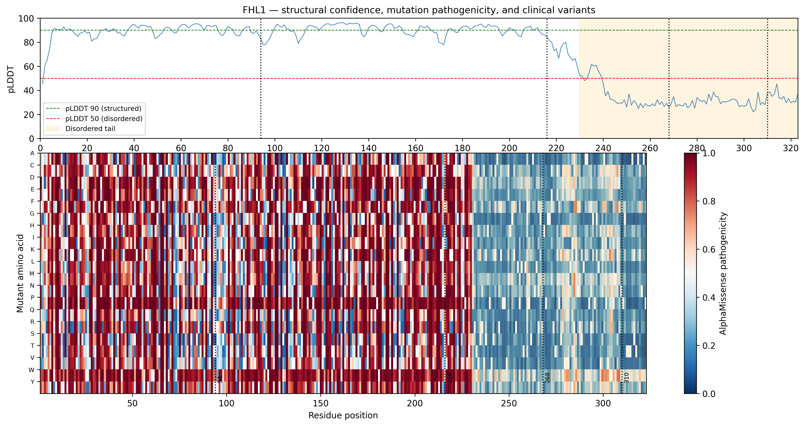
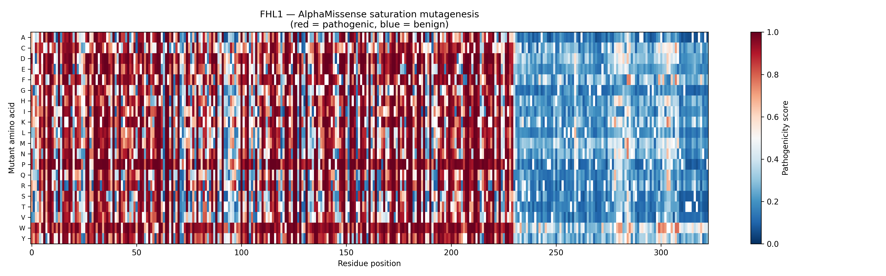

# FHL1 Structural Variant Analysis

### Does AlphaFold's structural confidence predict where FHL1 mutations cause disease?


---

## Thesis

FHL1 (Four and a Half LIM Domains Protein 1) is a tumour suppressor downregulated in breast cancer. It contains structured LIM domains and a disordered C-terminal tail unique to FHL1 among its family members.

**Hypothesis:** Mutations in FHL1's structured regions are damaging; mutations in its disordered tail are tolerated. AlphaFold confidence scores, AlphaMissense AI predictions, and ClinVar clinical data all converge on the same answer.

---

## Key finding



The two panels tell the same story independently. AlphaFold pLDDT scores (top) show FHL1 is highly structured from residues 1–230, then collapses into disorder at the C-terminal tail. AlphaMissense pathogenicity predictions (bottom) show the same boundary: LIM domain mutations are predominantly damaging (red), while tail mutations are tolerated (blue). ClinVar patient variants (dotted lines) at positions 268 and 310 fall in the tolerant region, consistent with the hypothesis that the disordered tail does not depend on precise sequence for its function.

---

## Project structure

```
├── notebooks/
│   ├── 01_protein_identification.ipynb   — identify proteins, download structures, 3D visualisation
│   ├── 02_plddt_analysis.ipynb           — structural confidence analysis across FHL family
│   ├── 03_alphamissense.ipynb            — variant pathogenicity prediction + ClinVar integration
│   └── 04_gene_expression.ipynb          — breast cancer differential expression (in progress)
├── data/
│   ├── raw/                              — original AlphaFold PDB files + AlphaMissense .gz
│   └── processed/                        — cleaned outputs (FHL1_alphamissense.csv)
├── figures/                              — all plots (300dpi PNG)
└── requirements.txt
```

---

## Results

### FHL1 is structurally unusual among its family

| Gene | Avg pLDDT | >90% confident | <50% disordered |
|------|-----------|----------------|-----------------|
| FHL1 | 73.1 | 40.4% | 26.4% |
| FHL2 | 92.3 | 81.5% | 0.0% |
| FHL3 | 91.8 | 79.3% | 0.4% |
| FHL4* | 92.2 | 81.3% | 0.0% |

*FHL4 is *Mus musculus* — human FHL4 not available in AlphaFold.

### FHL1 has a disordered C-terminal tail (residues 230–325)


### FHL2/3/4 remain structured throughout


### AlphaMissense confirms structured regions are mutation-intolerant

6,137 possible FHL1 missense variants scored. LIM domains (residues 1–230) are predominantly damaging (red). The disordered tail is predominantly tolerant (blue) — two independent computational methods reaching the same conclusion.



---

## Methods

- AlphaFold structures downloaded via UniProt accession IDs (Q13642, Q14192, Q13643, Q8CDC8)
- pLDDT scores extracted from B-factor column of ATOM records (CA atoms per residue)
- AlphaMissense scores downloaded from Zenodo (8,208,688 variants across human proteome), filtered for FHL1
- ClinVar pathogenic missense variants fetched via NCBI Entrez API (esearch + efetch)
- All figures generated with matplotlib at 300 dpi

### Limitations

- FHL4 structure is *Mus musculus* — human FHL4 not available in AlphaFold DB
- ClinVar uses a different FHL1 isoform than the AlphaFold canonical sequence — exact variant cross-referencing requires HGVS coordinate remapping (not implemented)
- Only 4 ClinVar pathogenic missense variants available for FHL1, limiting statistical power

---

## Completed

- [x] AlphaMissense pathogenicity scores for all 6,137 possible FHL1 missense variants
- [x] ClinVar pathogenic variant positions extracted
- [x] Integration figure: pLDDT + AlphaMissense heatmap + ClinVar positions
- [ ] Breast cancer gene expression analysis (GSE42568)

---

## Setup

```bash
pip install -r requirements.txt
```

---

## About

Self-directed bioinformatics project, winter break 2026.
BSc Biochemistry & Molecular Biology / Data Science — University of Sydney.
