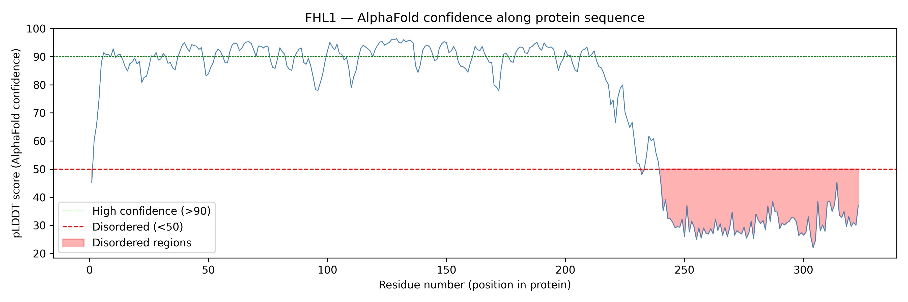
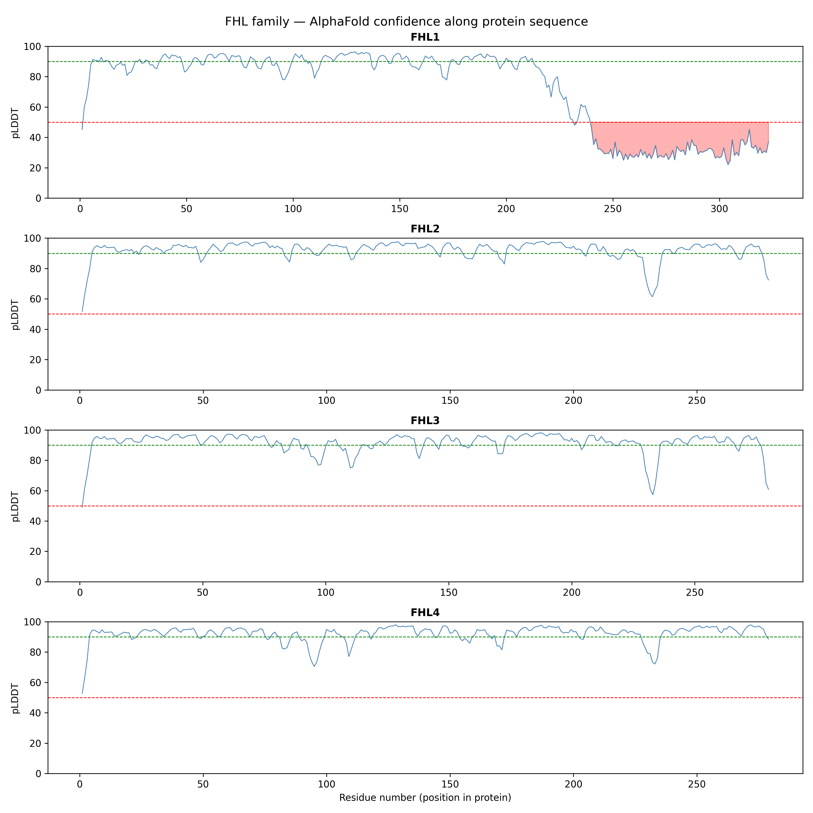

# FHL1 Structural Variant Analysis

### Does AlphaFold's structural confidence predict where FHL1 mutations cause disease?


---

## Thesis

FHL1 (Four and a Half LIM Domains Protein 1) is a tumour suppressor downregulated in breast cancer. It contains structured LIM domains and a disordered C-terminal tail unique to FHL1 among its family members.

**Hypothesis:** Mutations in FHL1's structured regions are damaging; mutations in its disordered tail are tolerated. AlphaFold confidence scores, AlphaMissense AI predictions, and ClinVar clinical data all converge on the same answer.

---

## Project structure

```
├── notebooks/
│   ├── 01_protein_identification.ipynb   — identify proteins, download structures, 3D visualisation
│   ├── 02_plddt_analysis.ipynb           — structural confidence analysis across FHL family
│   ├── 03_alphamissense.ipynb            — variant pathogenicity prediction (in progress)
│   └── 04_gene_expression.ipynb          — breast cancer differential expression (in progress)
├── data/
│   ├── raw/                              — original AlphaFold PDB files
│   └── processed/                        — cleaned outputs
├── figures/                              — all plots (300dpi PNG)
└── requirements.txt
```

---

## Key findings so far

### FHL1 is structurally unusual among its family

| Gene | Avg pLDDT | >90% confident | <50% disordered |
|------|-----------|----------------|-----------------|
| FHL1 | 73.1 | 40.4% | 26.4% |
| FHL2 | 92.3 | 81.5% | 0.0% |
| FHL3 | 91.8 | 79.3% | 0.4% |
| FHL4* | 92.2 | 81.3% | 0.0% |

*FHL4 is *Mus musculus* — human FHL4 not available in AlphaFold.

### FHL1 has a disordered C-terminal tail (residues 230–325)



### FHL2/3/4 remain structured throughout



---

## Methods

- AlphaFold structures downloaded via UniProt accession IDs
- pLDDT scores extracted from B-factor column of ATOM records
- Per-residue confidence plotted using matplotlib
- Species consistency verified from PDB SOURCE headers

---

## Next steps

- [ ] AlphaMissense pathogenicity scores for every FHL1 mutation
- [ ] ClinVar variant overlay
- [ ] Integration figure: pLDDT + AlphaMissense + ClinVar
- [ ] Breast cancer gene expression analysis (GSE42568)

---

## Setup

```bash
pip install -r requirements.txt
```

---

## About

Self-directed bioinformatics project, winter break 2026.
BSc Biochemistry & Molecular Biology / Data Science — University of Sydney.
